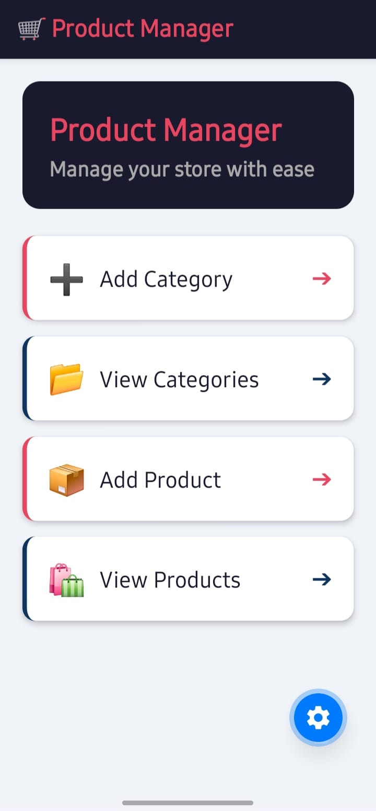
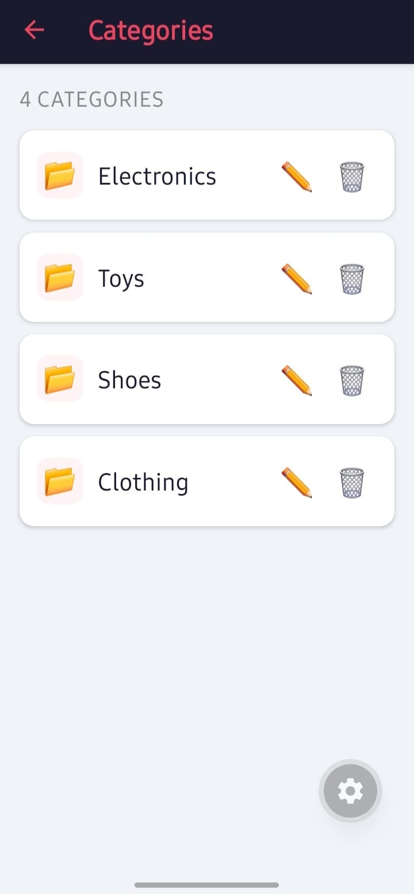
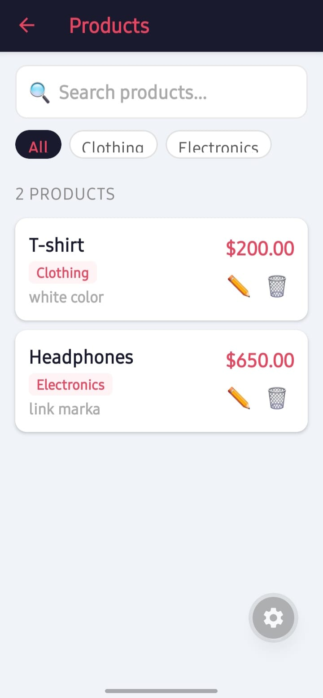
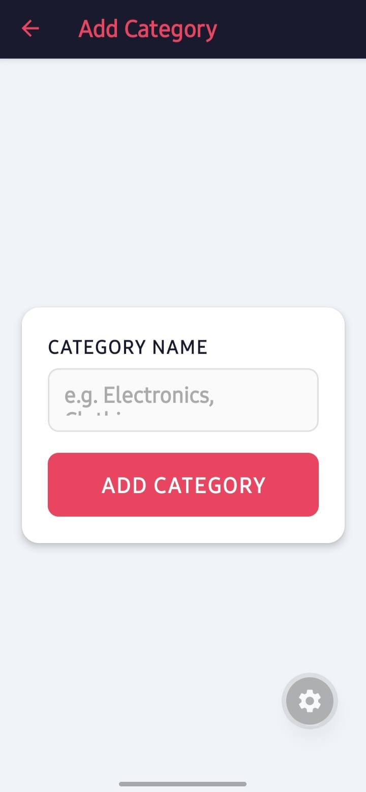
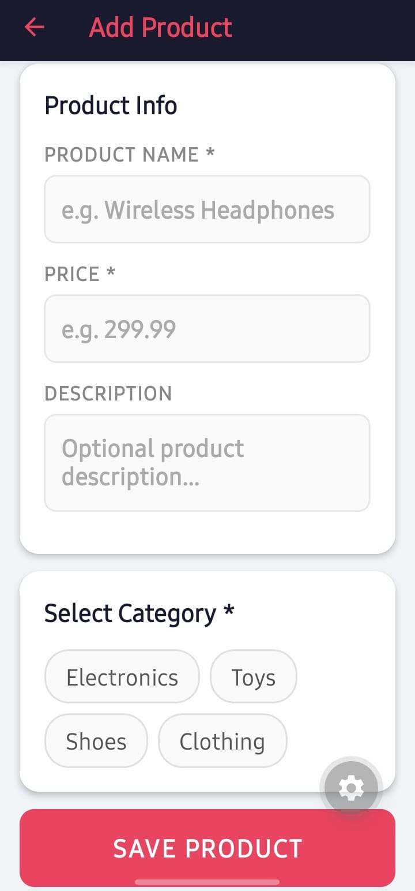

# 🛒 Product Manager App

A full-stack mobile application built with **React Native (Expo)** and **Firebase Firestore** for managing product categories and products. Built for SENG328 – Multi-Platform Application Development.

---

## 📱 Screenshots

| Home | Categories | Products |
|------|------------|----------|
| <br>4 quick-action cards | <br>List with inline edit/delete | <br>Search, filter, inline edit/delete |

### Additional Screenshots
| Add Category | Add Product |
|--------------|-------------|
|  <br> Form to add new category|  <br> Form to add new product with category selection|


---

## ✨ Features

- 📂 **Category Management** — Add, edit, and delete categories
- 📦 **Product Management** — Add products with name, price, description, and category
- 🔍 **Search** — Real-time product search by name
- 🏷️ **Filter** — Filter products by category
- ✏️ **Inline Edit** — Edit via bottom-sheet modal, no separate page needed
- 🗑️ **Delete** — Instant delete with confirmation
- 🔔 **Toast Feedback** — Animated success/error notifications for every action
- 🔄 **Pull to Refresh** — Swipe down to reload data
- ⚡ **Auto Refresh** — Lists refresh automatically when navigating back

---

## 🗂️ Project Structure

```
ProductApp/
├── firebaseConfig.ts          # Firebase initialization & Firestore export
├── components/
│   └── Toast.tsx              # Reusable animated toast notification
└── app/
    ├── _layout.tsx            # Root stack navigator with header styles
    ├── index.tsx              # Home screen with navigation cards
    ├── add-category.tsx       # Add new category form
    ├── category-list.tsx      # List categories with edit/delete
    ├── add-product.tsx        # Add new product form
    └── product-list.tsx       # List products with search, filter, edit/delete
```

---

## 🚀 Getting Started

### 1. Clone & Install

```bash
git clone <your-repo-url>
cd ProductApp
npx expo install
```

### 2. Install Dependencies

```bash
npx expo install firebase @react-navigation/native @react-navigation/stack react-native-screens react-native-safe-area-context react-native-gesture-handler react-native-reanimated
```

### 3. Configure Firebase

Go to [Firebase Console](https://console.firebase.google.com) and create a project:

1. Add a **Web app** to your project
2. Copy your config values
3. Open `firebaseConfig.ts` and replace the placeholders:

```ts
const firebaseConfig = {
  apiKey: "YOUR_API_KEY",
  authDomain: "YOUR_AUTH_DOMAIN",
  projectId: "YOUR_PROJECT_ID",
  storageBucket: "YOUR_STORAGE_BUCKET",
  messagingSenderId: "YOUR_MESSAGING_SENDER_ID",
  appId: "YOUR_APP_ID"
};
```

### 4. Set Firestore Rules

In Firebase Console → Firestore Database → **Rules** tab, paste:

```js
rules_version = '2';
service cloud.firestore {
  match /databases/{database}/documents {
    match /{document=**} {
      allow read, write: if true;
    }
  }
}
```

> ⚠️ These rules are open for development. Add authentication before going to production.

### 5. Run the App

```bash
npx expo start
```

Scan the QR code with the **Expo Go** app on your phone.

---

## 🗄️ Firestore Data Structure

### `categories` collection

| Field | Type | Description |
|-------|------|-------------|
| `name` | string | Category name (e.g. Electronics) |
| `createdAt` | timestamp | Date created |

### `products` collection

| Field | Type | Description |
|-------|------|-------------|
| `name` | string | Product name |
| `price` | number | Product price |
| `category` | string | Category name |
| `description` | string | Optional description |
| `createdAt` | timestamp | Date created |

---

## 🧭 Navigation Flow

```
Home
├── Add Category      → form → toast → back
├── View Categories   → list → ✏️ edit modal / 🗑️ delete
├── Add Product       → form → toast → back
└── View Products     → search + filter → list → ✏️ edit modal / 🗑️ delete
```

---

## 🛠️ Tech Stack

| Technology | Version | Purpose |
|------------|---------|---------|
| React Native | via Expo | Mobile UI framework |
| Expo Router | latest | File-based navigation |
| Firebase | ^10.x | Backend & database |
| Firestore | — | NoSQL cloud database |
| TypeScript | — | Type safety |

---

## 📋 Available Scripts

```bash
npx expo start          # Start development server
npx expo start --clear  # Start with cleared cache
npx expo start --tunnel # Start with tunnel (for network issues)
```

---

## ⚙️ Environment Notes

- Tested on **iOS** and **Android** via Expo Go
- Firebase project should be set to **Production mode** with open rules during development
- Pull-to-refresh and `useFocusEffect` ensure data is always up to date

---

## 📝 License

This project was created for educational purposes as part of **SENG328 – Multi-Platform Application Development**.
